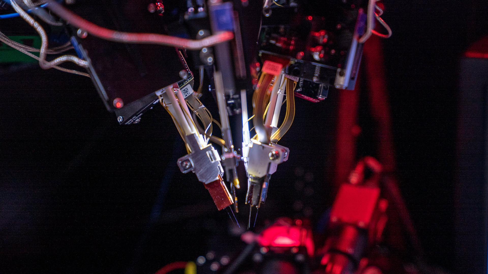

# Neuropixels Hardware at the Allen Institute

## Overview

The Allen Institute for Neural Dynamics uses Neuropixels probes as part of their comprehensive brain observatory platform. These high-density electrophysiology devices enable researchers to record the activity of hundreds of neurons simultaneously across multiple brain regions, providing unprecedented insights into neural circuit function.

*Neuropixels probes mounted on a recording rig at the Allen Institute. The system allows for simultaneous recording from multiple brain regions using up to 6 probes per experiment.*

## Application at the Allen Institute

The Allen Brain Observatory Neuropixels platform provides standardized in vivo neural activity measurements during visual stimulation and behavior. This platform builds on the Institute's earlier two-photon imaging brain observatory, extending its capabilities to record spiking activity with high temporal resolution at any depth within the mouse brain.

### Experimental Approach

The Allen Institute's Neuropixels workflow consists of six major steps:

1. **Surgical Preparation**: A custom headframe and glass window are implanted over visual cortex to provide stable access to the brain
2. **Intrinsic Signal Imaging (ISI)**: This procedure identifies and maps cortical visual areas to enable precise targeting
3. **Habituation**: Mice are habituated to head fixation and visual stimulation over a 2-week training period
4. **Insertion Window Implantation**: The glass window is replaced with a plastic window containing holes for probe insertion
5. **Electrophysiology Experiment**: Multiple Neuropixels probes (typically 6) are inserted into targeted brain regions
6. **Post-experiment Localization**: Optical projection tomography (OPT) is used to recover precise recording locations

### Brain Regions Targeted

With Neuropixels, the Allen Institute simultaneously records from neurons across multiple brain regions including:

- Cortical areas (for example, primary and higher visual areas like V1, LM, AL, PM, AM, RL)
- Hippocampus
- Thalamus

This multi-region approach allows researchers to study not only how individual neurons encode visual information but also how different brain areas interact during sensory processing.

### Data Collection Scale

The Allen Institute approach emphasizes standardization and scale:

- Each recording session captures data from hundreds of neurons simultaneously
- Recordings span multiple visual areas and deeper brain structures
- Both wild-type mice and transgenic lines expressing channelrhodopsin in specific inhibitory interneuron subtypes (Sst, Pvalb, Vip) are studied

## Data Processing and Access

The Allen Institute processes Neuropixels data through a standardized pipeline:

1. Data is synchronized across probes and behavioral measurements
2. Spike sorting identifies individual neurons and their activity patterns
3. Neurons are assigned to specific brain regions using the Allen Common Coordinate Framework
4. Quality metrics ensure data reliability
5. Data is packaged in standardized Neurodata Without Borders (NWB) format

The resulting dataset serves as a valuable resource for exploring sensory coding at both single-cell and population levels, as well as studying neural interactions within and between brain regions.

## Integration with Experimental Setup

The Neuropixels system is integrated with:

- Visual stimulus presentation using the Bonsai framework
- Running wheel for measuring locomotion
- Eye tracking for pupil measurements
- Precise synchronization hardware for alignment of neural, behavioral, and stimulus data

## Related Hardware

- [Behavior Platform](behavior_training.md)
- [SLAP2 Hardware](allen_institute_slap2_hardware.md)
- [Mesoscope Hardware](allen_institute_mesoscope_hardware.md)

## Additional Resources

- [Download the full Neuropixels Visual Coding White Paper (PDF)](https://brainmapportal-live-4cc80a57cd6e400d854-f7fdcae.divio-media.net/filer_public/80/75/8075a100-ca64-429a-b39a-569121b612b2/neuropixels_visual_coding_-_white_paper_v10.pdf)

## Related Documents

- **[Hardware Overview](../hardware-overview.md)**: Summary of all recording platforms used in the project
- **[Experimental Plan](../experimental-plan.md)**: How Neuropixels is used in different experimental paradigms
- **[Detailed Experimental Plan](../detailed-experimental-plan.md)**: Specific information about Neuropixels recording protocols