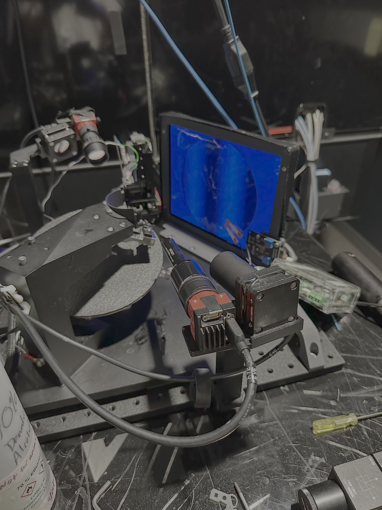

# Behavior Training Platform

This page describes the behavior training platform used for the OpenScope Community Predictive Processing project. The platform is designed to allow mice to run on a wheel while viewing visual stimuli on a screen, with systems for tracking running behavior and eye movements.

## Overview

Our behavior platform is designed to record mouse behavior during visual stimulus presentation. The platform includes:

- A running wheel for measuring locomotion
- A screen for presenting visual stimuli
- Eye tracking cameras
- Reward delivery system
- Headplate holder for head-fixed recordings

## Platform Variants

The core behavior platform design is adapted for different neural recording systems used in the project:

### Standard Behavior Platform

<figure>
  
  <figcaption>Figure 1: Standard behavior platform setup showing the complete assembly with running wheel, screen mount, and headplate holder.</figcaption>
</figure>

### SLAP2-Integrated Behavior Platform

<figure>
  
  <figcaption>Figure 2: Behavior platform integrated with the SLAP2 microscope. This configuration allows for simultaneous high-speed synaptic imaging while the mouse engages with the running wheel and visual stimuli.</figcaption>
</figure>

## Technical Specifications

- **Running Wheel**: Lightweight 3D-printed wheel with optical encoder for precise measurement of running speed
- **Visual Display**: 24-inch flat-screen monitor positioned ~15 cm from the mouse's eye
- **Eye Tracking**: Infrared camera system operating at 30 Hz
- **Reward Delivery**: Solenoid-controlled water reward system
- **Data Acquisition**: National Instruments data acquisition system recording at 1 kHz

## Behavioral Measurements

During experiments, we continuously record:

1. **Running Speed**: Measured in cm/s from the optical encoder
2. **Eye Position**: X and Y coordinates of pupil position
3. **Pupil Diameter**: Measurement of pupil dilation in mm
4. **Licking**: Detection of licks for reward consumption (when applicable)

These behavioral measurements are synchronized with neural recordings and stimulus presentations, allowing for analysis of neural activity in relation to behavioral state.

## Sensorimotor Mismatch Implementation

For the sensorimotor mismatch paradigm, we implement a closed-loop system where:

1. The running wheel rotation directly controls visual flow on the screen
2. The coupling between running and visual flow can be manipulated to create mismatch conditions
3. Visual flow can be sped up, slowed down, or completely decoupled from running behavior to create sensorimotor prediction errors

## Resources

For complete hardware details and CAD designs, visit the [Allen Institute Hardware Portal](https://portal.brain-map.org/explore/toolkit/hardware).

## Related Hardware

- [Mesoscope Hardware](allen_institute_mesoscope_hardware.md)
- [Neuropixels Hardware](allen_institute_neuropixels_hardware.md)
- [SLAP2 Hardware](allen_institute_slap2_hardware.md)

<!-- DISCUSSION_LINK_START -->

    

    

        <a href="https://github.com/allenneuraldynamics/openscope-community-predictive-processing/discussions/new?category=q-a&title=Discussion%3A%20hardware/behavior_training" target="_blank">
            💬 Start a discussion for this page on GitHub
        </a>
        (A GitHub account is required to create or participate in discussions)
    

<!-- DISCUSSION_LINK_END -->
