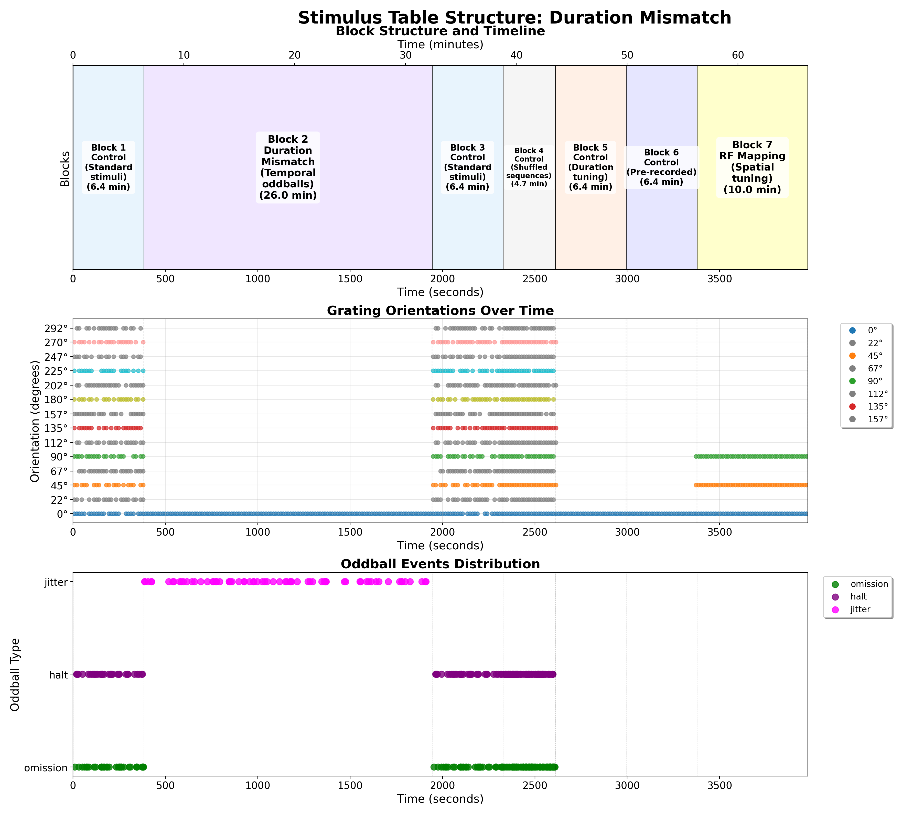

# Duration Mismatch Protocol

## Overview

The Duration Mismatch Protocol investigates how the brain forms predictions about temporal aspects of stimuli and detects violations in expected stimulus durations. This paradigm examines temporal predictive coding by establishing expectations for stimulus timing and duration, then introducing deviants that violate these temporal predictions.

## Stimulus Structure

The figure above shows a detailed analysis of the duration mismatch protocol:

1. **Block Structure Timeline**: Illustrates the temporal organization of different experimental phases:
   - **Jitter Oddball Blocks**: Main experimental periods where temporal expectations are established and violated
   - **Jitter Control Blocks**: Control periods with temporal variations but without established expectations
   - **RF Mapping Blocks**: Spatial tuning phases

2. **Grating Orientations Over Time**: Shows the sequence of visual stimuli presented throughout the session

3. **Oddball Events Distribution**: Highlights when temporal violations occur, including:
   - **Jitter Events**: Unexpected changes in stimulus duration or timing
   - **Omission Events**: Missing stimuli at expected times

## Key Features

### Temporal Predictive Coding
- Establishes regular temporal patterns to create timing expectations
- Introduces duration deviants to study temporal prediction errors
- Examines neural adaptation to temporal structure

### Experimental Design
- **Standard Durations**: Regular stimulus presentations with consistent timing
- **Duration Deviants**: Stimuli with unexpected durations (shorter or longer than standard)
- **Timing Violations**: Changes in inter-stimulus intervals
- **Omission Trials**: Expected stimuli that are omitted entirely

### Applications
This protocol is particularly useful for studying:
- Temporal processing in visual cortex
- Neural mechanisms of timing prediction
- Adaptation to temporal structure
- Prediction error signals for temporal violations

## Parameters

### Basic Timing Parameters
- **Standard Duration**: Regular stimulus presentation duration
- **Deviant Durations**: Variations from standard timing
- **Inter-stimulus Intervals**: Time between stimulus presentations
- **Jitter Range**: Amount of temporal variation introduced

### Control Conditions
- **Regular Sequences**: Predictable timing patterns
- **Random Sequences**: Unpredictable timing for comparison
- **Omission Probability**: Frequency of omitted stimuli

<!-- DISCUSSION_LINK_START -->

    

    

        <a href="https://github.com/allenneuraldynamics/openscope-community-predictive-processing/discussions/new?category=q-a&title=Discussion%3A%20stimuli/duration-mismatch" target="_blank">
            💬 Start a discussion for this page on GitHub
        </a>
        (A GitHub account is required to create or participate in discussions)
    

<!-- DISCUSSION_LINK_END -->
