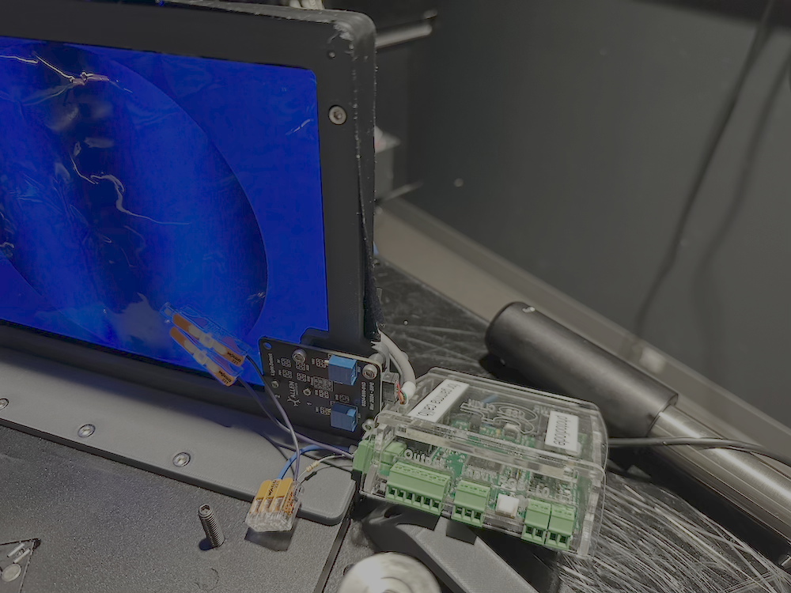
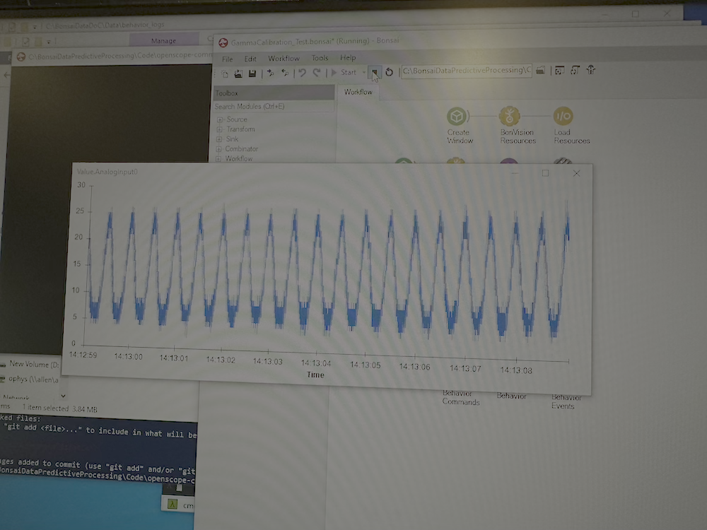
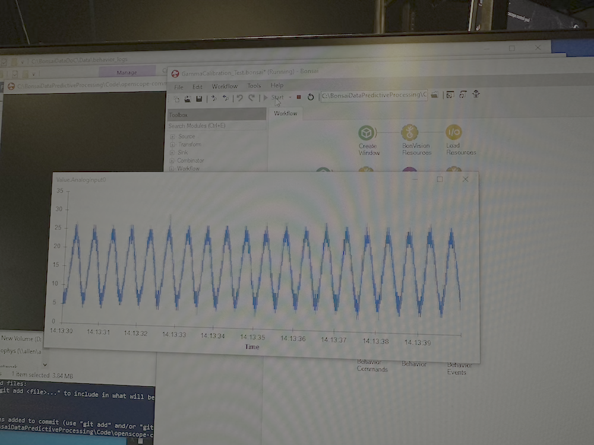

# Gamma Calibration

This page provides instructions on how to perform gamma calibration for visual stimuli in the OpenScope Community Predictive Processing project.

## What is Gamma Calibration?

Gamma calibration is essential for visual stimuli experiments, as it ensures a linear relationship between the numeric pixel intensity values in your program and the actual light intensity displayed on the monitor.

Computer monitors and projectors have non-linear relationships between the numeric values sent to them (0-255 for an 8-bit display) and the actual light intensity they produce. For example, doubling the numeric value might not double the light output.

In visual neuroscience experiments, we need precise control over the actual light intensities to ensure accurate stimuli presentation. Gamma calibration compensates for these non-linearities by creating a lookup table that transforms the desired linear intensity values into the appropriate non-linear values that will produce a linear response on the display.

## Hardware Requirements

To perform gamma calibration, you need:

1. **Light Sensor/Photodiode**: 
        
   [PDB-C156](https://www.digikey.com/en/products/detail/advanced-photonix/PDB-C156/480587)

2. **Data Acquisition Device (DAQ)**:
        
        - Arduino board
        - HARP board
        - Any other DAQ that can be read with Bonsai

## Software Requirements

Our gamma calibration workflows are built using [Bonsai](https://bonsai-rx.org/) and require:

1. **Bonsai** (version 2.4 or higher)
2. **BonVision** package for Bonsai
3. Our custom [gamma calibration extensions](https://github.com/AllenNeuralDynamics/openscope-community-predictive-processing/tree/main/code/Gamma) (included in this repository)

## Gamma Calibration Procedure

### Step 1: Setup

1. Connect your light sensor to an analog channel of your DAQ.
2. Position the sensor facing the monitor or projector that you want to calibrate.
3. Ensure no other light sources are affecting the sensor readings.
4. Clone this repository and navigate to the `code/GammaCalibration` folder.

### Step 2: Calibrating the Display

1. Open either [`GammaCalibration_FitGray.bonsai`](https://github.com/AllenNeuralDynamics/openscope-community-predictive-processing/blob/main/code/Gamma/GammaCalibration_FitGray.bonsai) (for grayscale calibration)
2. Configure the `AnalogInput` node to match your DAQ setup.
3. Adjust the `CreateWindow` node properties to match your display settings.
4. Position your photodiode on the screen. 
5. Run the workflow.
6. The calibration process will create a gamma lookup table image that will be saved where specified in the `FileName` parameter of the `SaveImage` node.
7. This lookup table can then be used in your BonVision workflows by adding the `GammaCorrection` node and providing the path to the saved lookup table image.

### Pre-generated Lookup Tables

For convenience, we provide pre-generated gamma lookup tables for some of our standard rigs:

- [SLAP2 Lookup Table](https://github.com/AllenNeuralDynamics/openscope-community-predictive-processing/blob/main/code/Gamma/Rigs/2025-05-22-SLAP2-gammalut.bmp)

These BMP files contain a pixel-to-pixel mapping that transforms input pixel values (0-255) to output pixel values that will produce a linear light response on the specific display. Each row in the image represents a different color channel (R, G, B), allowing precise control over the color response of the display.

## Step 3: Using the Gamma Lookup Table

After calibration, include the generated lookup table in your stimuli presentations:

1. In your stimulus workflow, add the `GammaCorrection` node after your stimulus generation nodes and before rendering.
2. Set the `LookupTable` property to the path of your saved calibration image.

### Testing the Calibration

To verify your gamma calibration and see how to use the calibrated lookup table in practice:

1. Open the [`GammaCalibration_Test.bonsai`](https://github.com/AllenNeuralDynamics/openscope-community-predictive-processing/blob/main/code/Gamma/GammaCalibration_Test.bonsai) workflow.
2. Configure the `AnalogInput` node to match your DAQ setup.
3. Make sure the `GammaCorrection` node is enabled in the workflow.
4. Set the `GammaLut` property of the `GammaCorrection` node to point to your saved calibration image.
5. Run the workflow to display a series of intensity ramps and test patterns.
6. Compare the photodiode measurements with and without gamma correction (you can toggle the `GammaCorrection` node by enabling/disabling it).
7. A properly calibrated display should show a linear relationship between the requested intensity values and the measured light output when gamma correction is enabled.

#### Before and After Gamma Correction

Below you can see the difference in measurement before and after applying gamma correction to an oscillating sinusoidal stimulus:

*Before gamma correction: The photodiode response shows significant distortion of the sinusoidal pattern. Notice how the peaks are sharper than the troughs, indicating a non-linear relationship between input values and light output.*

*After gamma correction: The photodiode response closely follows a true sinusoid, with balanced peaks and troughs. This indicates a much more linear relationship between requested intensity values and actual light output.*

## References

- This implementation is based on [BonVision's Gamma Calibration](https://bonvision.github.io/demos/demos_004_GammaCalibration/).
Note that we modified this code as we encountered a few bugs in the original implementation. 
