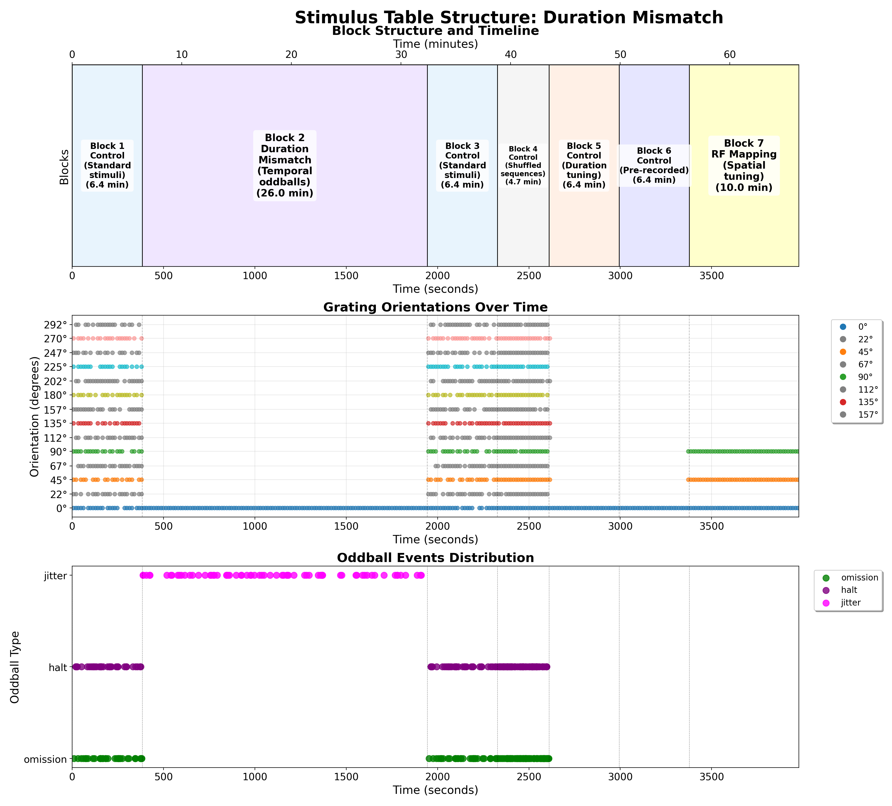

# Oddball Session Scripts

This document provides an overview of the scripts specifically used for oddball experimental protocols in this project.

## Standard Oddball Protocol

- **Standard_oddball.bonsai** - The standard oddball protocol script (generic version)
    - Located in `code/stimulus-control/src/`
    - For detailed information, see [Standard Oddball Protocol](standard-oddball.md)

- **Standard_oddball_slap2.bonsai** - Standard oddball protocol optimized for SLAP2 hardware
    - Located in `code/stimulus-control/src/`
    - For detailed information, see [Standard Oddball Protocol](standard-oddball.md)

## Standard Oddball with Jitter Random Protocol

- **Standard_oddball_jitter_random.bonsai** - Standard oddball protocol with jittered timing and randomized presentation
    - Located in `code/stimulus-control/src/`
    - For detailed information, see [Standard Oddball Jitter Random Protocol](standard-oddball-jitter-random.md)

## Sensory-Motor Oddball Protocol

- **Sensory_motor_oddball_slap2.bonsai** - Implements the sensory-motor oddball paradigm for SLAP2 hardware
    - Located in `code/stimulus-control/src/`
    - For detailed information, see [Sensory-Motor Closed Loop Protocol](sensory-motor-closed-loop.md)

## Sequence Mismatch Protocol

- **Sequence Mismatch Protocol** - Implements the sequence mismatch paradigm with learned sequences
    - For detailed information, see [Sequence Mismatch Protocol](sequence-mismatch.md)

## Generic Oddball Protocol

- **generic_oddball.bonsai** - Unified framework for running multiple experimental paradigms using CSV-defined stimulus parameters
    - Located in `code/stimulus-control/src/Mindscope/`
    - Works with `generate_experiment_csv.py` to create flexible, reproducible experiments
    - Supports standard oddball, jitter, sequential, and motor paradigms
    - For detailed information, see [Generic Oddball Protocol](generic-oddball.md)

## Bonsai Instructions

For instructions on how to set up and run these Bonsai scripts, please refer to:
- [Bonsai Instructions](bonsai_instructions.md)

## Adding a New Script to Documentation

If you've created a new script that should be added to this documentation, follow these steps:

1. Place your Bonsai script in `code/stimulus-control/src/`

2. Add your script to this list with a brief description

3. For a new experimental protocol, create a markdown file in `docs/stimuli/` explaining:
    - Protocol purpose
    - Key parameters and settings
    - Running instructions
    - Output formats
    - Hardware considerations

4. Update `mkdocs.yml` to include your new markdown file

---

# Stimulus Protocols and Analysis

This document provides an overview of the stimulus protocols in this project, now including comprehensive analysis visualizations generated from actual experimental data.

## Protocol Analysis Overview

All stimulus protocols have been analyzed using real experimental data to provide clear visualizations of:
- **Block Structure**: Temporal organization of experimental phases
- **Stimulus Progression**: Evolution of stimulus parameters over time  
- **Oddball Distribution**: Timing and frequency of mismatch events

## Available Protocols

### 1. Visual Mismatch (Standard Oddball)

- **Description**: Classic oddball paradigm with orientation deviants
- **Documentation**: [Standard Oddball Protocol](standard-oddball.md)
- **Key Features**: 0°/45°/90° orientation violations, RF mapping

### 2. Sequence Mismatch

- **Description**: Sequential learning paradigm with pattern violations
- **Documentation**: [Sequence Mismatch Protocol](sequence-mismatch.md)
- **Key Features**: Learned sequences, position-specific violations

### 3. Sensory-Motor Mismatch

- **Description**: Closed-loop paradigm with motor-visual coupling violations
- **Documentation**: [Sensory-Motor Closed-Loop](sensory-motor-closed-loop.md)
- **Key Features**: Wheel-coupled stimuli, expectation violations

### 4. Duration Mismatch

- **Description**: Temporal predictive coding with duration violations
- **Documentation**: [Duration Mismatch Protocol](duration-mismatch.md)
- **Key Features**: Timing violations, temporal jitter

### 5. Control Protocols

- **Description**: Control conditions without oddball violations
- **Key Features**: Matched stimulation without prediction errors

## Analysis Features

Each protocol analysis includes:
1. **Block Timeline**: Shows duration and sequence of experimental blocks
2. **Orientation Progression**: Displays stimulus parameters over time
3. **Oddball Events**: Highlights timing and distribution of mismatch events

These visualizations are generated from actual stimulus tables and provide researchers with clear expectations of experimental structure and timing.

---

## Legacy Documentation

The following sections contain the original protocol listings:

## Standard Oddball Protocol

- **Standard_oddball.bonsai** - The standard oddball protocol script (generic version)
    - Located in `code/stimulus-control/src/`
    - For detailed information, see [Standard Oddball Protocol](standard-oddball.md)

- **Standard_oddball_slap2.bonsai** - Standard oddball protocol optimized for SLAP2 hardware
    - Located in `code/stimulus-control/src/`
    - For detailed information, see [Standard Oddball Protocol](standard-oddball.md)

## Standard Oddball with Jitter Random Protocol

- **Standard_oddball_jitter_random.bonsai** - Standard oddball protocol with jittered timing and randomized presentation
    - Located in `code/stimulus-control/src/`
    - For detailed information, see [Standard Oddball Jitter Random Protocol](standard-oddball-jitter-random.md)

## Sensory-Motor Oddball Protocol

- **Sensory_motor_oddball_slap2.bonsai** - Implements the sensory-motor oddball paradigm for SLAP2 hardware
    - Located in `code/stimulus-control/src/`
    - For detailed information, see [Sensory-Motor Closed Loop Protocol](sensory-motor-closed-loop.md)

## Sequence Mismatch Protocol

- **Sequence Mismatch Protocol** - Implements the sequence mismatch paradigm with learned sequences
    - For detailed information, see [Sequence Mismatch Protocol](sequence-mismatch.md)

## Generic Oddball Protocol

- **generic_oddball.bonsai** - Unified framework for running multiple experimental paradigms using CSV-defined stimulus parameters
    - Located in `code/stimulus-control/src/Mindscope/`
    - Works with `generate_experiment_csv.py` to create flexible, reproducible experiments
    - Supports standard oddball, jitter, sequential, and motor paradigms
    - For detailed information, see [Generic Oddball Protocol](generic-oddball.md)

## Bonsai Instructions

For instructions on how to set up and run these Bonsai scripts, please refer to:
- [Bonsai Instructions](bonsai_instructions.md)

## Adding a New Script to Documentation

If you've created a new script that should be added to this documentation, follow these steps:

1. Place your Bonsai script in `code/stimulus-control/src/`

2. Add your script to this list with a brief description

3. For a new experimental protocol, create a markdown file in `docs/stimuli/` explaining:
    - Protocol purpose
    - Key parameters and settings
    - Running instructions
    - Output formats
    - Hardware considerations

4. Update `mkdocs.yml` to include your new markdown file

---

## Related Documents

- **[Bonsai Instructions](bonsai_instructions.md)**: How to set up and run Bonsai scripts
- **[Standard Oddball](standard-oddball.md)**: Details about the standard oddball paradigm 
- **[Sensory-Motor Closed Loop](sensory-motor-closed-loop.md)**: Information about the sensory-motor paradigm
- **[Sensory-Motor Coupling](sensory-motor-coupling.md)**: Technical details about wheel-to-visual coupling implementation
- **[Experimental Plan](../experimental-plan.md)**: Overview of all experimental paradigms

<!-- DISCUSSION_LINK_START -->

    

    

        <a href="https://github.com/allenneuraldynamics/openscope-community-predictive-processing/discussions/new?category=q-a&title=Discussion%3A%20stimuli/list_scripts" target="_blank">
            💬 Start a discussion for this page on GitHub
        </a>
        (A GitHub account is required to create or participate in discussions)
    

<!-- DISCUSSION_LINK_END -->
