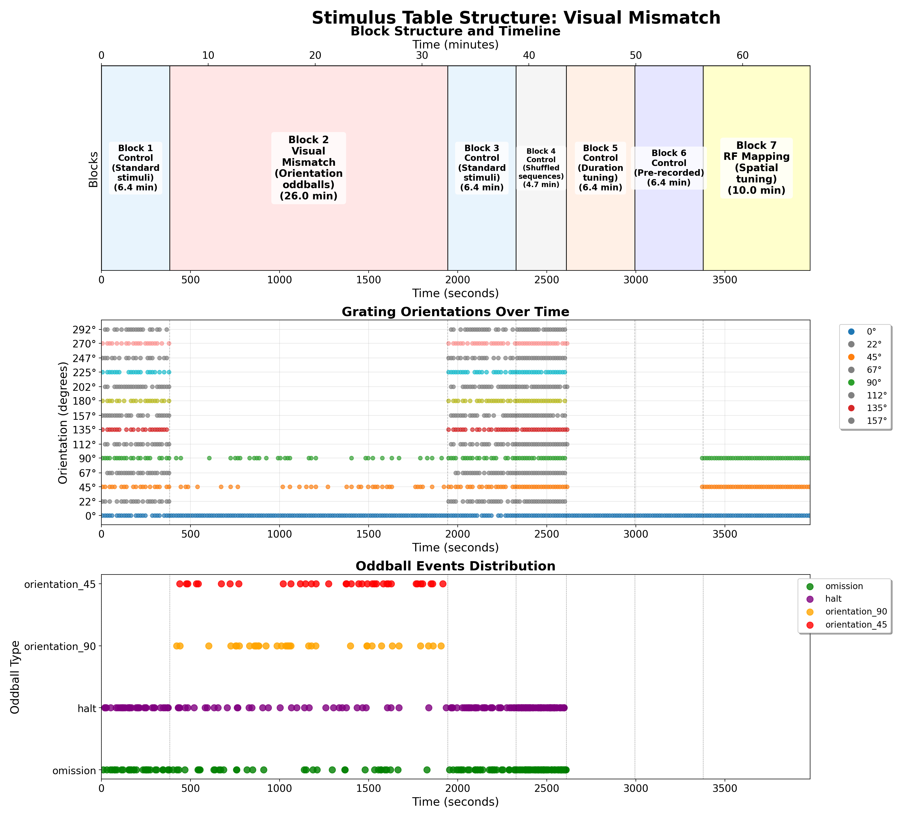

# Standard Oddball Stimulus

## Overview

The Standard Oddball stimulus is designed to investigate predictive coding and stimulus-specific adaptation in the visual cortex. The experiment presents a series of visual gratings where a "standard" stimulus is repeatedly shown, establishing sensory expectations, which are occasionally violated by "deviant" stimuli that differ in orientation, contrast, or temporal frequency.

## Stimulus Structure

The figure above shows a comprehensive analysis of the visual mismatch (standard oddball) stimulus structure, including:

1. **Block Structure Timeline**: Shows the temporal organization of different experimental blocks including control, oddball, and RF mapping phases
2. **Grating Orientations Over Time**: Displays the sequence of grating orientations presented throughout the session, with different colors representing different orientation values (0°, 45°, 90°)
3. **Oddball Events Distribution**: Highlights the timing and distribution of oddball events (orientation_45, orientation_90, halt, omission, jitter) across the experimental timeline

The analysis demonstrates the structured presentation of:
- **Standard Control Blocks**: Baseline periods with standard stimuli
- **Visual Mismatch Blocks**: Periods with orientation oddball events (45° and 90° deviants)
- **RF Mapping Blocks**: Spatial tuning phases with localized stimuli

## Script Location

The stimulus script is located at:
- [`/code/stimulus-control/src/Standard_oddball_slap2.bonsai`](https://github.com/AllenNeuralDynamics/openscope-community-predictive-processing/blob/main/code/stimulus-control/src/Standard_oddball_slap2.bonsai)

## Hardware Requirements

- SLAP2 imaging system
- Behavior device with encoder/wheel for tracking animal movement
- Digital outputs (DO2) for synchronization with recording equipment

## Stimulus Parameters

### Basic Parameters
- **Display Type**: Drifting gratings
- **Spatial Frequency**: 0.04 cycles per degree
- **Temporal Frequency**: 2 Hz (standard)
- **Contrast**: 1.0 (full contrast)
- **Size**: 360° (full-field gratings)
- **Stimulus Duration**: 343 ms
- **Inter-stimulus Interval**: 343 ms (configurable "Delay" parameter)

### Configurable Parameters
The script contains several externalized parameters that can be adjusted:
- `NbBaselineGrating`: Number of standard gratings (default: 20)
- `NbMismatchPerCondition`: Number of repetitions for each deviant condition (default: 1)
- `NbReceptiveFieldRepeats`: Number of repetitions for receptive field mapping (default: 1)

## Experimental Design

### 1. Orientation Tuning Component
The experiment includes presentation of 16 different orientations:
- 0°, 22.5°, 45°, 67.5°, 90°, 112.5°, 135°, 157.5°
- 180°, 202.5°, 225°, 257.5°, 270°, 292.5°, 315°, 337.5°

These orientations are presented in randomized order to characterize orientation tuning of neurons.

### 2. Standard-Oddball Paradigm
The core of the experiment consists of:

- **Standard Stimulus**: 0° orientation grating with 2 Hz temporal frequency (repeated ~20 times)
- **Deviant Stimuli**: 
    - **Orientation deviants**: 45° and 90° oriented gratings
    - **Temporal frequency deviant**: 0 Hz (stationary grating at 0° orientation)
    - **Contrast deviant**: 0 contrast (blank screen) with 2 Hz temporal frequency

Each deviant type violates a different expectation established by the standard stimulus:
- Orientation deviants test orientation-specific adaptation
- Temporal frequency deviant tests motion expectation
- Contrast deviant tests luminance expectation

### 3. Receptive Field Mapping
The experiment includes a mapping component with smaller gratings (20° diameter) presented at locations defined in `receptive_field.csv`. These specialized mapping gratings have:
- Higher spatial frequency (0.08 cpd)
- Higher temporal frequency (4 Hz)
- Higher contrast (0.8)
- Shorter duration (250 ms)
- No inter-stimulus interval (0 ms delay)

The receptive field mapping coordinates and orientations are loaded from the CSV file and randomized for each presentation sequence.

## Data Collection

The script logs all stimulus parameters and timing information to CSV files:
- `orientations_logger.csv`: Contains timing of stimulus events
- `orientations_orientations.csv`: Records the parameters of each stimulus presentation

Animal running data is collected via an encoder on Port 2 of the behavior device.

## Synchronization
- TTL pulses (100ms) are generated at stimulus onset via DO2 output
- SLAP2 recording is automatically started and stopped during the experiment

## Running the Experiment
1. Start the Bonsai workflow
2. Press the spacebar to begin the experiment
3. The experiment can be terminated with the End key

## Related Documents

- **[Bonsai Instructions](bonsai_instructions.md)**: Setup and deployment of Bonsai code
- **[Experimental Plan](../experimental-plan.md)**: Overview of all experimental paradigms
- **[SLAP2 Hardware](../hardware/allen_institute_slap2_hardware.md)**: Details about the SLAP2 imaging system used
- **[Example Experiment](../experiments/allen_institute/slap2/allen_institute_794237_2025-04-03.md)**: Session notes from an experiment using this stimulus

<!-- DISCUSSION_LINK_START -->

    

    

        <a href="https://github.com/AllenNeuralDynamics/openscope-community-predictive-processing/discussions/54" target="_blank">
            💬 Join the discussion for this page on GitHub
        </a>
    

<!-- DISCUSSION_LINK_END -->
